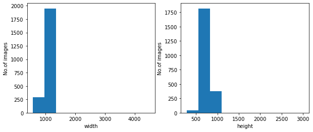
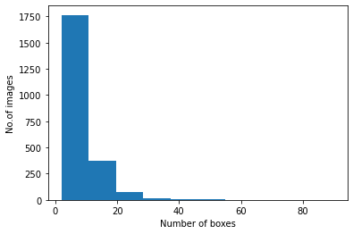
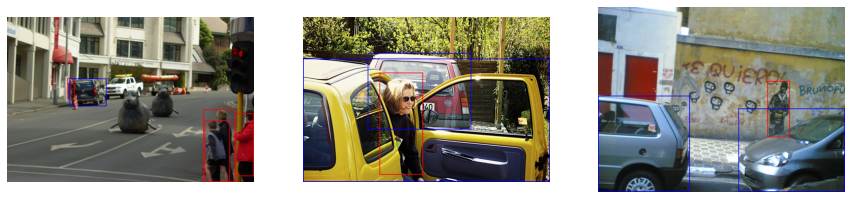
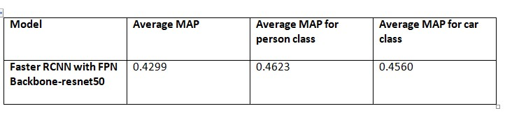
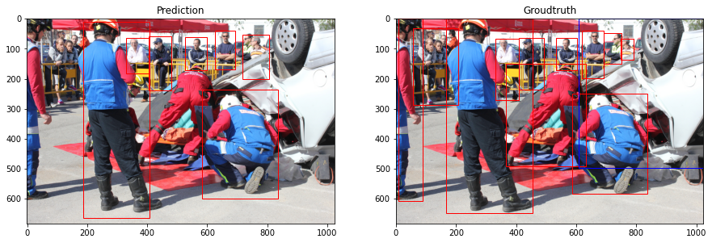
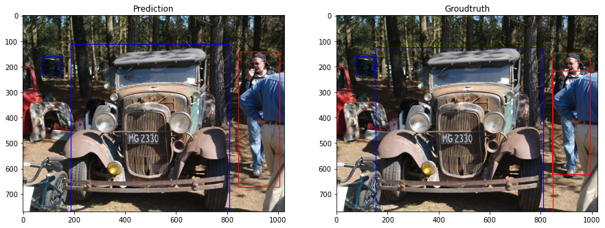
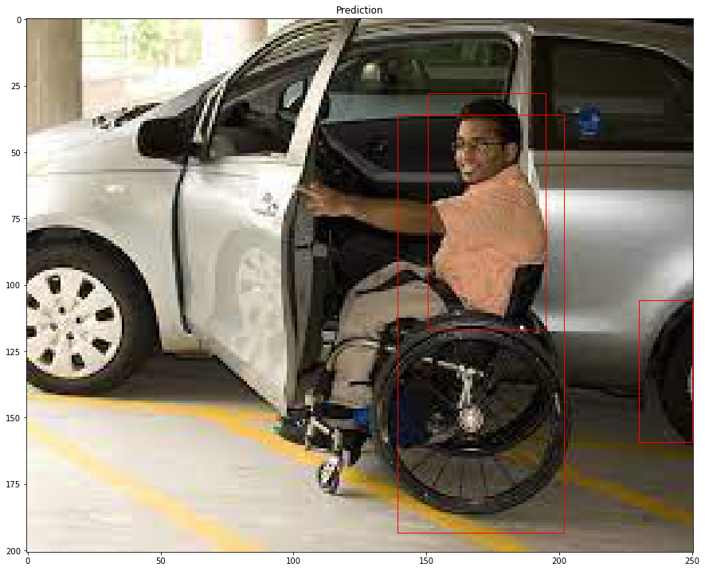
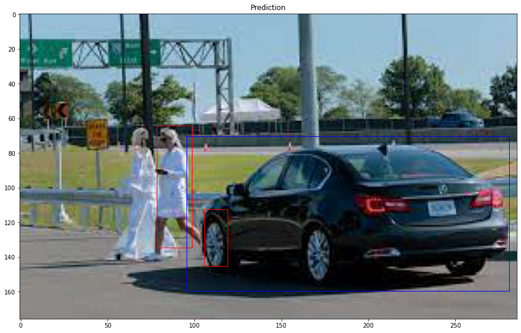

# Object-detection-using-FasterRCNN
Implementing the Object detection on a custom dataset using FasterRCNN pytorch

Note: 
1. Please check the requirements from requirements.txt
2. Make sure the path of the files are changed accordingly

Please download the trained-model from https://drive.google.com/drive/folders/1jfb4rJqrpFWp3r36_ALp5y5nW6Qzcrvv?usp=sharing
# All about the dataset

The dataset is in th format of COCO for two classes - person and car. The following are the EDA performed on the dataset.

Total number of images in the dataset:  2239

There are images with 98 different width values and 233 different height values

The distribution of the different heights and widths over images 

Total boxes annotated in the dataset  : 16769 ->  {'person': 10797, 'car': 5972}
The distribution of the number of bounding boxes in images 

Avg. number of person boxes per image: 4

Avg. number of car boxes per image: 2

All images have different dimensions betweent the range of height: 282 to 3000  and width: 575 to 4496

Number of minimum bounding boxes 2

Number of maximum bounding boxes 90

Some of the sample images in the dataset

# Assumptions made

1. The annotated boxes with same xmin and xmax values or same ymin and ymax values are removed as they do not contribute to a bounding box
2. The class annotations are labeled as {1: person , 2: car} where 0th class is considered to b bakground
3. Training the weights from a pretrained model for this dataset (as the sample size is less) gives better performance than training from scratch
4. MAP - Mean Average precision is used as a performance metric

# FasterRCNN with FPN model 

The implementation of FPN model for a custom object detection is taken from the below link

https://pytorch.org/vision/stable/_modules/torchvision/models/detection/faster_rcnn.html

Optimizer used - SGD(Stochastic Gradient descent)
Loss - As from the pre-trained model 

{'loss_classifier', 'loss_box_reg', 'loss_objectness', 'loss_rpn_box_reg'} - The sum of all these losses are backpropagated for optimization

Epochs-100

# Results

# FasterRCNN with FPN model - sample results from validation set

# Test any image through the notebook - Demo_testing_model.ipynb

Sample results from random google images

# Next steps:
As a pretrained architecture without any fine tuning is implemented, the following can be next steps to improvise the results
1. Anchor box tuning - by modifying the rpn (region proposal network) anchor generator in the model using rpn.Anchorgenerator where we can give specific anchor box sizes and aspect ratios.
2. ROI pooling tuning - Modyfying the multi scale roi allignment of the ROI pooling layer
3. Trying a different advanced object detection architecture - (YOLO-PP,  different backbone network, etc)
4. Different preprocesssing techniques 

